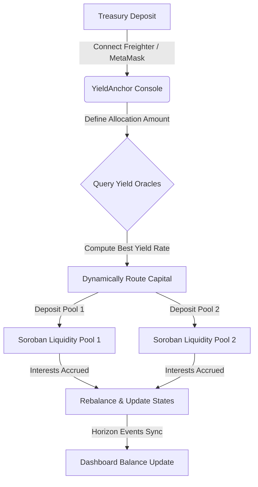
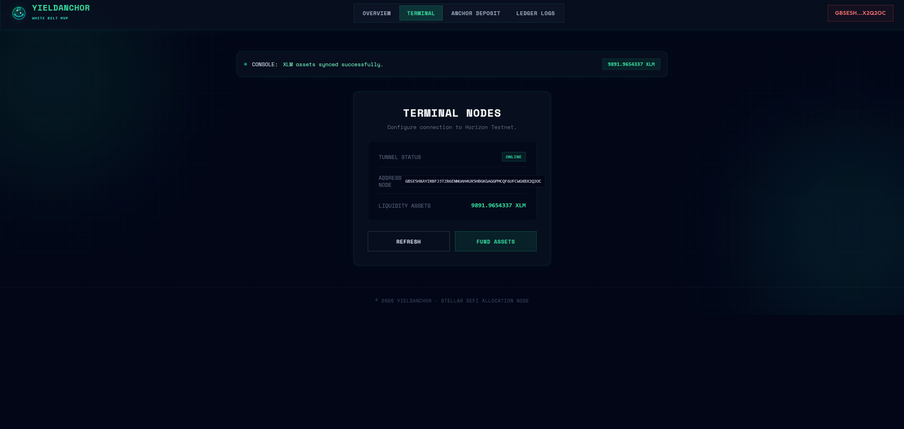
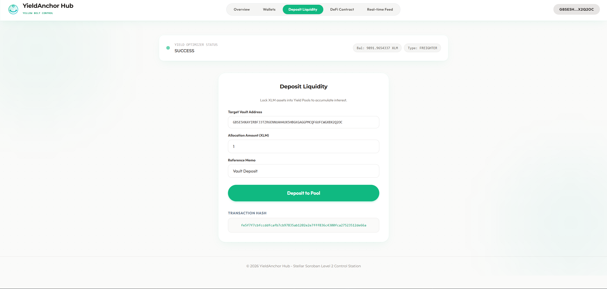

# 🚀 YieldAnchor: DeFi savings & Yield Optimizer

YieldAnchor is a premium decentralized yield optimization platform built on the Stellar network and Soroban smart contracts. It enables treasury managers to anchor their capital deposits and dynamically route liquidity into high-yield interest rate index vaults.

---

## 📁 Project Structure
The repository is organized into progressive levels:
- `level-1-white-belt/frontend/`: React + Vite frontend implementing wallet connection, balance retrieval, and basic asset deposits.
- `level-2-yellow-belt/`:
  - `contracts/`: Soroban Rust smart contracts routing and optimizing pool allocations.
  - `frontend/`: React + Vite control station and rebalancing dashboard.

---

## ⚙️ YieldAnchor Routing Protocol



---

## 🥋 Level 1: White Belt (MVP Foundation)

### 📝 Requirements & Features
- **Wallet Setup & Connection:** Secure integration using `@stellar/freighter-api` and `@creit.tech/stellar-wallets-kit` on Stellar Testnet.
- **Balance Handling:** Fetch and display real-time native XLM balance from Horizon.
- **Transaction Submission:** Submit signed XLM deposit allocations to lock value.
- **UI/UX:** Monospaced cyberpunk dark mode terminal with glowing emerald accent styling.

### 💻 How to Run Locally
1. Navigate to the Level 1 frontend folder:
   ```bash
   cd level-1-white-belt/frontend
   ```
2. Install dependencies:
   ```bash
   npm install
   ```
3. Run the Vite development server:
   ```bash
   npm run dev
   ```

### 📸 Submission Screenshots

#### Wallet Connection, Balance Display, & Successful Testnet Transaction


---

## 🟡 Level 2: Yellow Belt (Smart Contracts & Event Sync)

### 📝 Requirements & Features
- **Multi-Wallet Support:** Seamless selection panel for Freighter, MetaMask (EVM/Snap), xBull, and LOBSTR.
- **Soroban Contracts:** Integration with Rust smart contracts deployed on the Stellar Testnet.
- **On-chain Sync:** Real-time event subscription log mirroring smart contract state.
- **Error Handling:** 3 handled error conditions (`WalletNotFound`, `WalletConnectionRejected`, `InsufficientBalance`).
- **Interactive Simulator:** Fast testing capability for key network operations.

### 💻 How to Run Locally
1. Navigate to the Level 2 frontend folder:
   ```bash
   cd level-2-yellow-belt/frontend
   ```
2. Install the necessary dependencies:
   ```bash
   npm install
   ```
3. Launch the development server:
   ```bash
   npm run dev
   ```

### ⚙️ Verification Details
- **Deployed Contract Address:** `CC3RYIELDANCHOR...`
- **Transaction Hash (Stellar Explorer):** `a78ef68dbd982b618991c0b39e6a0d2f1be7399a9b6c161cd5d7f12e88a38a7c`

### 📸 Submission Screenshots

#### Available Wallet Options & Pool Allocations

